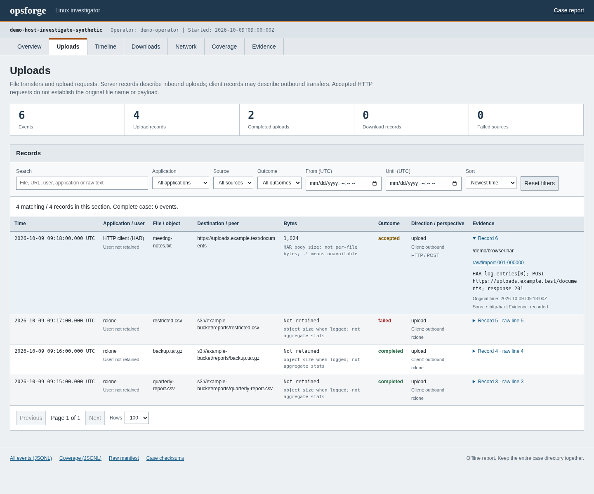

# opsforge

**Collect evidence. Investigate activity. Report clearly.**

A blue-team toolkit for endpoint triage, forensic evidence collection, security
audits, and troubleshooting. Bash and PowerShell tools cover Linux and Windows.
The guided forensic investigator currently runs on Linux x86_64.

**Beta:** useful today, with coverage still expanding. See the
[latest release](https://github.com/iamb4uc/opsforge/releases/latest).

## What you can do

- Triage hosts, review persistence, and check network exposure.
- Audit SSH, privileges, configuration drift, and service health.
- Investigate retained upload/download records, browser activity, and logs.
- Collect timed network traffic and build searchable device timelines.
- Preserve raw evidence, structured JSON, source coverage, and readable reports.

The investigator supports retained FTP, rclone, HTTP access-log, and HAR transfer
records, plus Chromium downloads. The wider toolkit includes Linux and Windows
collection profiles and individual operational checks.

## Quick start

Launch the Linux investigator:

```bash
curl -fsSL https://raw.githubusercontent.com/iamb4uc/opsforge/main/investigate/install-and-run.sh -o /tmp/opsforge-investigate-bootstrap && bash /tmp/opsforge-investigate-bootstrap --install-deps --remove-bootstrap
```

The bootstrap verifies the release archive, installs missing dependencies when
requested, and opens the setup TUI. No Rust toolchain is needed on the target.
It uses existing root access or asks for sudo.

Choose collection options, extra log paths, and an output location in the TUI.
Live capture defaults to `5m`; custom durations use `s`, `m`, `h`, or `d`.
Cases default to `/var/lib/opsforge/cases/`. Temporary download and bootstrap
files are removed after the run; the case directory stays.

For the Linux/Windows command toolkit, see [installation and usage](docs/usage.md).

## Reports you can inspect



*Actual opsforge dashboard rendered from synthetic demo records.*

The offline dashboard has Overview, Uploads, Timeline, Downloads, Network,
Coverage, and Evidence tabs. Search and filter the complete event collection,
then follow records back to their raw sources.

Cases include raw evidence, normalized JSONL, a source manifest, SHA-256 hashes,
and Markdown/HTML reports. Keep the whole case directory when sharing it.

## Coverage and limits

Collection is read-only by default; dependency installation is an explicit
bootstrap option. Modifying operational tools require explicit action flags.

Historical detail depends on what the device or imported logs retained.
Browser visits alone do not prove uploads, and a filename does not establish
payload recovery. Source failures, unsupported formats, and missing records stay
visible. Review collected data before sharing it.

## Documentation and feedback

- [Investigator setup, supported sources, and limits](docs/linux-investigator.md)
- [Commands and collection profiles](docs/usage.md)
- [Output format](docs/output-format.md) and [report standard](docs/report-standard.md)
- [Testing](docs/testing.md), [runtime validation](docs/runtime-validation.md), and [compatibility](docs/compatibility.md)
- [Security reporting](SECURITY.md) · [GPL-3.0 license](LICENSE)

Found a broken collection path or need another evidence format?
[Open an issue](https://github.com/iamb4uc/opsforge/issues) with the platform,
tool version, and sanitized details. If opsforge is useful, a star helps others
find it.
